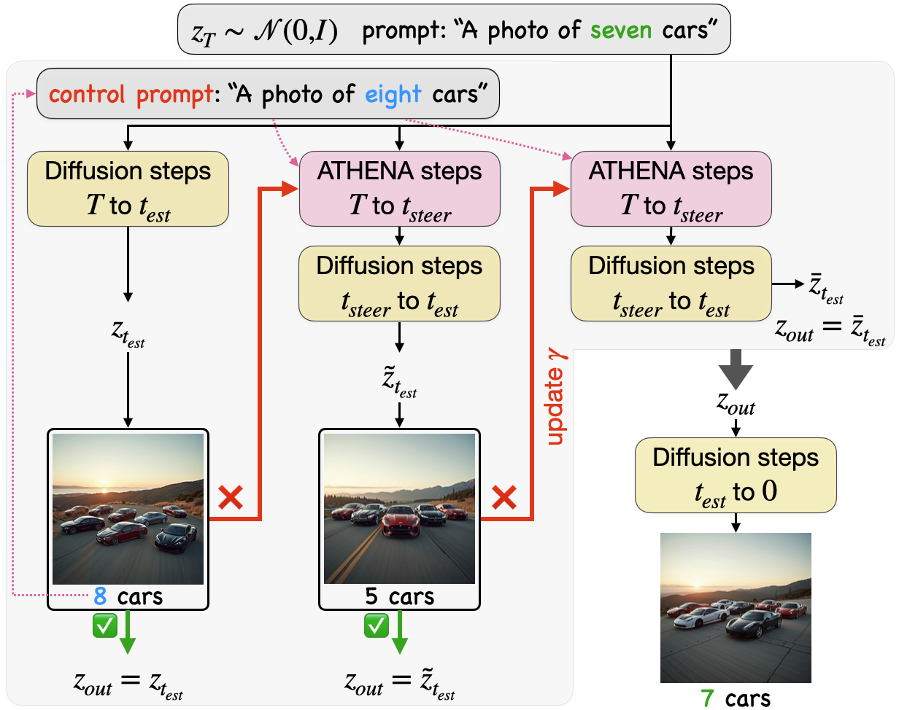
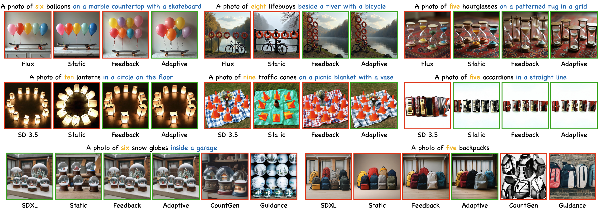

<p align="center">
  
</p>

<h1>
ATHENA: Adaptive Test-Time Steering for Improving Count Fidelity in Diffusion Models
</h1>

<h3 align="center">Mohammad Shahab Sepehri, Asal Mehradfar, Berk Tinaz, </br> Salman Avestimehr, Mahdi Soltanolkotabi</h3>

<!-- <p align="center">
| 📄 <a href="https://openreview.net/pdf?id=NBU5IJGhCf">Paper</a> |
</p>  -->

<p align="center">
  <a href="LICENSE"></a>
</p>

<p align="justify" > 
ATHENA is a model-agnostic, test-time adaptive steering framework that improves object count fidelity without modifying model architectures or requiring retraining. We present three progressively more advanced variants of ATHENA that trade additional computation for improved numerical accuracy, ranging from static prompt-based steering to dynamically adjusted count-aware control.
</p>
<p align="center">
  
</p>
<p align="justify"> 
ATHENA variants preserve scene structure and color consistency while handling
relational and multi-object instructions. Compared to prior baselines, ATHENA avoids visual artifacts and background distortion, with
adaptive steering yielding the most accurate counts.
</p>

<p align="center">
  
</p>
<p align="justify"> 

## 📖 Table of Contents
  * [Requirements](#-requirements)
  * [Usage](#-usage)
    * [Single Generation](#single-generation)
    * [Dataset Evaluation](#dataset-evaluation)
  * [Citation](#-citation)

## 🔧 Requirements

Create and activate a `conda` environment with the following command:
```
conda env create -f environment.yml
conda activate athena
```

Please note that you may need access to the HuggingFace repositories for some of the diffusion models.

## 🔰 Usage

### Single Generation

<p align="justify" > 
To generate a single image, you can use the following command
</p>

```bash
python scripts/generate.py \
  --prompt PROMPT \
  --object OBJECT \
  --num_object TARGET_NUMBER_OF_OBJECTS \
  --model_name MODEL_NAME \
  --model_args_path PATH_TO_CONFIG \
  --save_path SAVE_PATH
  --seed SEED

```
- `PROMPT`: Your desired prompt.
- `OBJECT`: The singular noun of the object whose numerical fidelity you want to control.
- `TARGET_NUMBER_OF_OBJECTS`: The desired number of instances of the object.
- `MODEL_NAME`: The name of the model. It can be one of: `flux`, `sd`, or `sdxl`.
- `PATH_TO_CONFIG`: The path to the model’s configuration file. Example config files can be found in `configs/models`.
- `SAVE_PATH`: The path to save the results, the default is `Results/`.

An example of single image generation:

```bash
python scripts/generate.py \
  --prompt "A photo of seven Athena goddesses in a park" \
  --object "athena goddess" \
  --num_object 7 \
  --model_name sd \
  --model_args_path configs/models/sd/adaptive/default.json

```

### Dataset Evaluation

To evaluate the performance over a dataset, use the following command:

```bash
python scripts/eval.py \
  --dataset_path PATH_TO_DATASET \
  --model_name MODEL_NAME \
  --model_args_path PATH_TO_CONFIG \
  --save_path SAVE_PATH

```
- `PATH_TO_DATASET`: The path to the `json` file of the dataset.
- `MODEL_NAME`: The name of the model. It can be one of: `flux`, `sd`, or `sdxl`.
- `PATH_TO_CONFIG`: The path to the model’s configuration file. Example config files can be found in `configs/models`.
- `SAVE_PATH`: The path to save the results, the default is `Results/`.


An example of dataset evaluation:

```bash
python scripts/eval.py \
  --dataset_path datasets/ATHENA.json \
  --model_name flux \
  --model_args_path configs/models/flux/adaptive/default.json 

```

## 📌 Citation

If you use our code or dataset, please cite our [paper](https://arxiv.org/abs/2603.19676).

```bibtex
@article{sepehri2026athena,
      title={ATHENA: Adaptive Test-Time Steering for Improving Count Fidelity in Diffusion Models},
      author={Mohammad Shahab Sepehri and Asal Mehradfar and Berk Tinaz and Salman Avestimehr and Mahdi Soltanolkotabi},
      journal={arXiv preprint arXiv:2603.19676},
      year={2026}
}
```
